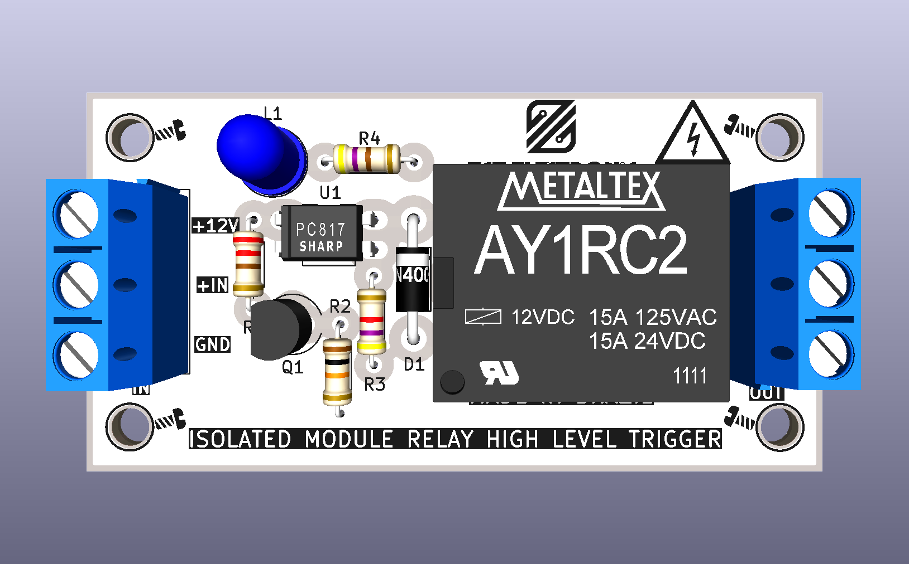
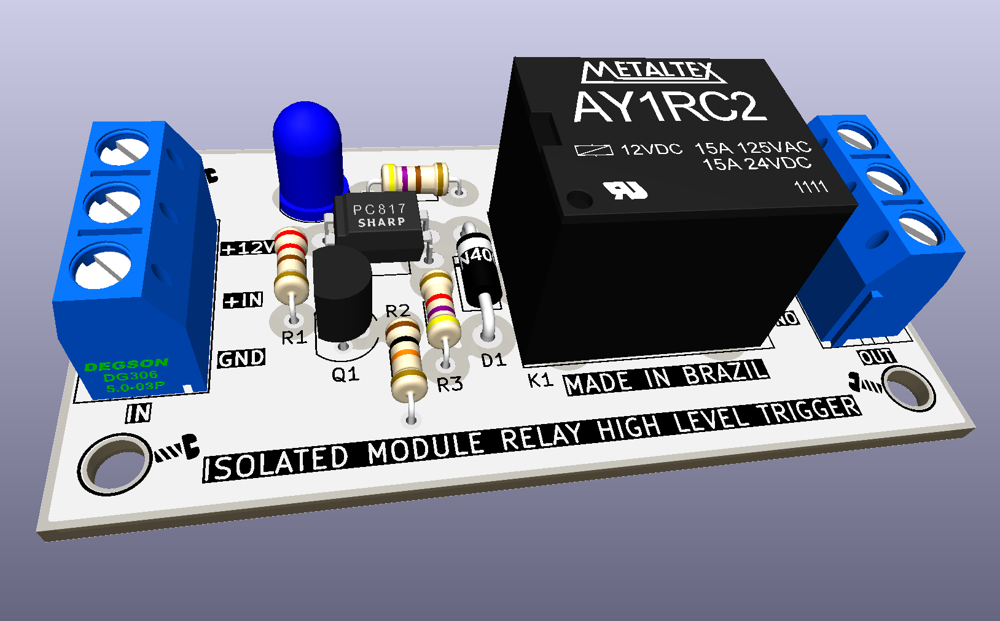
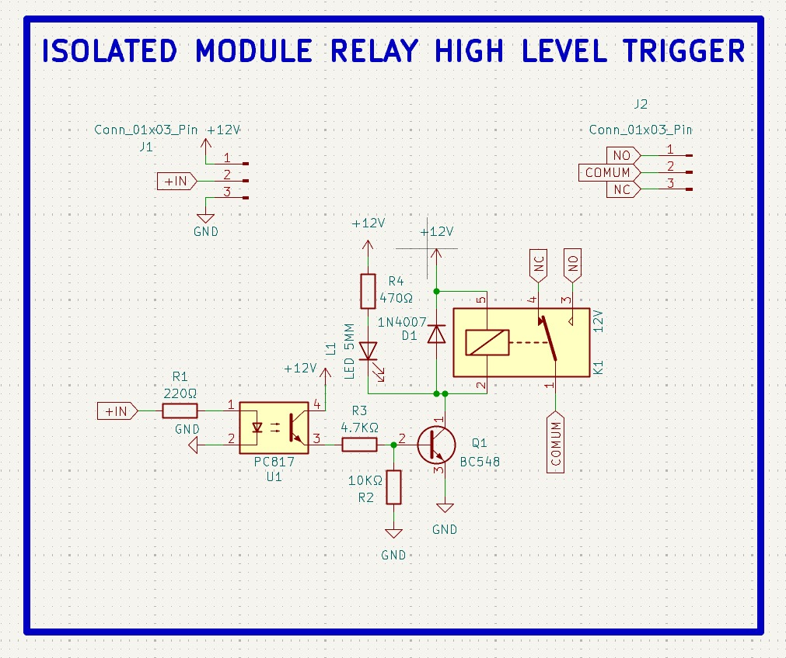

<div align="center">



# MODULE RELAY

**Módulo de relé isolado com acionamento por nível alto (High Level Trigger), componentes totalmente através-furo (PTH), isolação óptica e relé de potência 12VDC / 15A**

[](https://www.kicad.org/)
[](.)
[](.)
[](.)
[](.)
[](.)
[](.)

</div>

---

## 📋 Índice

- [MODULE RELAY](#module-relay)
  - [📋 Índice](#-índice)
  - [Visão Geral](#visão-geral)
  - [Imagens do Projeto](#imagens-do-projeto)
  - [Diferenças em relação ao MODULE RELAY SMD](#diferenças-em-relação-ao-module-relay-smd)
  - [Funcionalidades](#funcionalidades)
  - [Diagrama de Funcionamento](#diagrama-de-funcionamento)
  - [Especificações Técnicas](#especificações-técnicas)
  - [Lista de Materiais](#lista-de-materiais)
  - [Pinagem dos Conectores](#pinagem-dos-conectores)
    - [J1 — Entrada (Controle)](#j1--entrada-controle)
    - [J2 — Saída (Carga)](#j2--saída-carga)
  - [Aplicações](#aplicações)
  - [Estrutura do Repositório](#estrutura-do-repositório)
  - [Como Usar](#como-usar)
    - [Conexão básica com Arduino / ESP32](#conexão-básica-com-arduino--esp32)
    - [Exemplo de código Arduino](#exemplo-de-código-arduino)
    - [Dica de Montagem](#dica-de-montagem)
  - [⚠️ Avisos de Segurança](#️-avisos-de-segurança)
  - [Sobre](#sobre)

---

## Visão Geral

**MODULE RELAY** é um módulo de acionamento de relé com **isolação galvânica total** entre o circuito de controle e a carga, projetado pela **ZAT ELECTRONIC** utilizando **KiCad 10**. Diferente da versão SMD, esta placa utiliza exclusivamente **componentes através-furo (PTH)**, tornando-a ideal para montagem manual, prototipagem e laboratórios maker.

O circuito utiliza o optoacoplador **PC817** (DIP-4 PTH) para isolar eletricamente o sinal de controle (proveniente de microcontroladores como Arduino, ESP32, etc.) do circuito de potência. O transistor **BC548** (TO-92 PTH) aciona a bobina do relé de potência 12VDC, capaz de comutar cargas de até **15A em 125VAC ou 24VDC**.

> ⚡ **High Level Trigger** — o relé é acionado com sinal lógico alto (+3,3V ou +5V) no pino de entrada, com proteção por isolação óptica para máxima segurança do microcontrolador.

---

## Imagens do Projeto

<div align="center">


*Vista superior — relé de potência, optoacoplador PC817 DIP, transistor BC548 e bornes KRE*

<br/>



*Vista isométrica — componentes PTH, LED azul 5mm e layout geral da placa*

<br/>


*Modelo 3D da PCB — visão completa com todos os componentes montados*

<br/>


*Layout da PCB — roteamento, furos e serigrafias*

<br/>



*Esquemático completo — circuito de isolação óptica, driver e relé*

</div>

---

## Diferenças em relação ao MODULE RELAY SMD

| Característica | MODULE RELAY (PTH) | MODULE RELAY SMD |
|----------------|-------------------|-----------------|
| **Tipo de montagem** | Através-furo (PTH) | Montagem superficial (SMD) |
| **Optoacoplador** | PC817 DIP-4 PTH | PC817S SOP-4 SMD |
| **Transistor driver** | BC548 (TO-92 PTH) | MMBT2222A-TP (SOT-23 SMD) |
| **Resistores** | Axial 0,5W PTH | SMD 0805 |
| **LED de status** | 5mm PTH azul | SMD 0805 |
| **Diodo de roda livre** | 1N4007 PTH axial | 1N4007 SMA SMD |
| **Facilidade de montagem** | Alta — soldagem manual simples | Requer soldagem SMD |
| **Público alvo** | Iniciantes, makers, laboratório | Produção, compacto, profissional |

---

## Funcionalidades

- ✅ **Relé de potência 12VDC / 15A** — contatos SPDT (NO, COM, NC), 15A 125VAC / 15A 24VDC
- ✅ **Isolação óptica via PC817** (DIP-4 PTH) — proteção galvânica total entre controle e carga
- ✅ **Transistor BC548** (TO-92 PTH) — driver NPN para acionamento da bobina
- ✅ **Diodo de roda livre 1N4007** (PTH axial) — proteção contra tensão reversa da bobina
- ✅ **LED azul 5mm PTH** — indicação visual de relé acionado
- ✅ **High Level Trigger** — compatível com 3,3V e 5V (Arduino, ESP32, Raspberry Pi, etc.)
- ✅ **Bornes KRE parafuso** (3 pinos, passo 5,0mm) — conexão robusta para entrada e saída
- ✅ **Todos os componentes PTH** — montagem manual fácil, ideal para prototipagem
- ✅ **Made in Brazil** — serigrafia na PCB

---

## Diagrama de Funcionamento

```
Microcontrolador / Sinal de Controle
        │
    +IN ●──[R1 220Ω]──► PC817 (LED interno)
    GND ●──────────────► PC817 (GND interno)
                               │
                         (Isolação óptica)
                               │
                         PC817 (Transistor)
                               │
              +12V ──[R4 470Ω]──► LED L1 (status azul)
              +12V ──[R3 4,7KΩ]──► Base BC548 (Q1)
                               │
                        [R2 10KΩ] pull-down (Base→GND)
                               │
                        Coletor BC548 (Q1)
                               │
                    Bobina K1 (Relé 12VDC)
                               │
                        [D1 1N4007] ← Flyback
                               │
                        GND ───┘

              Contatos do Relé (J2 — OUT)
         ┌────────────────────────────────┐
         │   NO  │  COMUM  │  NC          │
         └────────────────────────────────┘
          Carga: até 15A / 125VAC ou 24VDC
```

---

## Especificações Técnicas

| Parâmetro | Valor |
|-----------|-------|
| **Relé** | 12VDC / SPDT (Form C) |
| **Tensão da Bobina** | 12VDC |
| **Corrente máx. de carga (AC)** | 15A @ 125VAC |
| **Corrente máx. de carga (DC)** | 15A @ 24VDC |
| **Tipo de contato** | SPDT — NO, NC, COM |
| **Tensão de alimentação do módulo** | +12V |
| **Tensão de controle (sinal IN)** | 3,3V a 5V (High Level Trigger) |
| **Isolação** | Óptica — PC817 DIP-4 |
| **Transistor driver** | BC548 (TO-92, NPN) |
| **Diodo de proteção** | 1N4007 (PTH axial) |
| **LED de status** | 5mm PTH azul |
| **Resistores** | Axial 0,5W PTH |
| **Conectores** | Borne KRE parafuso 3 pinos, passo 5,0mm |
| **Ferramenta de Projeto** | KiCad 10 |
| **Tipo de montagem** | PTH — Através-furo |

---

## Lista de Materiais

| Ref | Componente | Valor / Parte | Encapsulamento |
|-----|-----------|--------------|----------------|
| K1 | Relé de Potência | 12VDC / 15A SPDT | PTH |
| U1 | Optoacoplador | PC817 | DIP-4 PTH |
| Q1 | Transistor NPN | BC548 | TO-92 PTH |
| D1 | Diodo de Roda Livre | 1N4007 | PTH Axial |
| L1 | LED de Status | LED 5mm Azul | PTH 5mm |
| R1 | Resistor de entrada (opto) | 220Ω | Axial 0,5W PTH |
| R2 | Resistor pull-down (base) | 10KΩ | Axial 0,5W PTH |
| R3 | Resistor de base (transistor) | 4,7KΩ | Axial 0,5W PTH |
| R4 | Resistor de LED | 470Ω | Axial 0,5W PTH |
| J1 | Borne de Entrada (Controle) | +12V, +IN, GND | KRE 3 pinos 5,0mm |
| J2 | Borne de Saída (Carga) | NO, COM, NC | KRE 3 pinos 5,0mm |

---

## Pinagem dos Conectores

### J1 — Entrada (Controle)

| Pino | Sinal | Descrição |
|------|-------|-----------|
| 1 | +12V | Alimentação da bobina do relé |
| 2 | +IN | Sinal de controle (3,3V–5V = relé ON) |
| 3 | GND | Terra comum |

### J2 — Saída (Carga)

| Pino | Sinal | Descrição |
|------|-------|-----------|
| 1 | NO | Normalmente aberto (fecha quando acionado) |
| 2 | COM | Terminal comum do relé |
| 3 | NC | Normalmente fechado (abre quando acionado) |

---

## Aplicações

- 🏠 **Automação residencial** — acionamento de lâmpadas, tomadas e ventiladores
- 🤖 **Projetos com Arduino e ESP32** — controle de cargas AC com isolação galvânica
- 🏫 **Ensino e prototipagem** — componentes PTH facilmente soldáveis e substituíveis
- 💡 **Controle de iluminação** — painéis de LED de alta potência e luminárias
- 🔌 **Proteção de circuitos** — isolação entre lógica de baixa tensão e rede elétrica
- 📡 **IoT e domótica** — integração com sistemas MQTT, Home Assistant, etc.

---

## Estrutura do Repositório

```
MODULE_RELAY/
├── MODULE_RELAY.kicad_pro        # Arquivo de projeto KiCad
├── MODULE_RELAY.kicad_sch        # Esquemático (KiCad 10)
├── MODULE_RELAY.kicad_pcb        # Layout da PCB (KiCad 10)
├── MODULE_RELAY.kicad_prl        # Configurações locais do projeto
├── packages3D/                   # Modelos 3D arquivados (STEP / WRL)
│   ├── PC817_DIP.step
│   ├── Relé_12VDC_15A.STEP
│   ├── DG306-5.0-03P-12-00AH.STEP
│   ├── Transistor BC548.STEP
│   ├── Diodo 1N4007.STEP
│   ├── LED 5mm Blue.step
│   └── Resistor Axial 0.5W *.STEP
├── fp-info-cache                 # Cache de footprints
├── imagem_1.png                  # Render 3D superior
├── imagem_2.png                  # Render 3D isométrico
├── PCB_3D_MODEL.jpg              # Modelo 3D da PCB
├── LAYOUT_PCB.jpg                # Layout da PCB
├── SCHEMATIC.jpg                 # Imagem do esquemático
└── README.md
```

---

## Como Usar

### Conexão básica com Arduino / ESP32

```
Arduino / ESP32             MODULE RELAY
───────────────────         ─────────────────
GND              ────────►  J1 - GND
Pino digital     ────────►  J1 - +IN

Fonte 12VDC (+)  ────────►  J1 - +12V
Fonte 12VDC (-)  ────────►  J1 - GND

Carga AC/DC      ────────►  J2 - COM + NO (ou NC)
```

### Exemplo de código Arduino

```cpp
#define RELAY_PIN 7

void setup() {
  pinMode(RELAY_PIN, OUTPUT);
  digitalWrite(RELAY_PIN, LOW); // relé desligado na inicialização
}

void loop() {
  digitalWrite(RELAY_PIN, HIGH); // aciona o relé
  delay(1000);
  digitalWrite(RELAY_PIN, LOW);  // desaciona o relé
  delay(1000);
}
```

### Dica de Montagem

> 🔧 Por ser totalmente PTH, recomenda-se a seguinte ordem de soldagem: resistores primeiro, depois diodo, transistor BC548, optoacoplador PC817, LED, relé e por último os bornes KRE.

## ⚠️ Avisos de Segurança

> 🔴 **ATENÇÃO — TENSÕES PERIGOSAS**

- Este módulo pode comutar tensões de **rede elétrica (110V / 220V AC)**. Manuseie com extremo cuidado.
- **Nunca toque nos terminais J2 (OUT)** enquanto houver carga CA conectada e o circuito energizado.
- Utilize **caixa de proteção** adequada quando instalar em ambientes com acesso de pessoas.
- Respeite a **corrente máxima de 15A** nos contatos do relé.
- A isolação óptica protege o microcontrolador, mas **não substitui normas de segurança elétrica**.
- Projeto destinado a **profissionais e experimentadores experientes**.

---

## Sobre

<div align="center">

Projetado por **ZAT ELECTRONIC**

*MODULE RELAY — Made in Brazil 🇧🇷*

[](https://www.kicad.org/)
[](https://www.oshwa.org/)

</div>